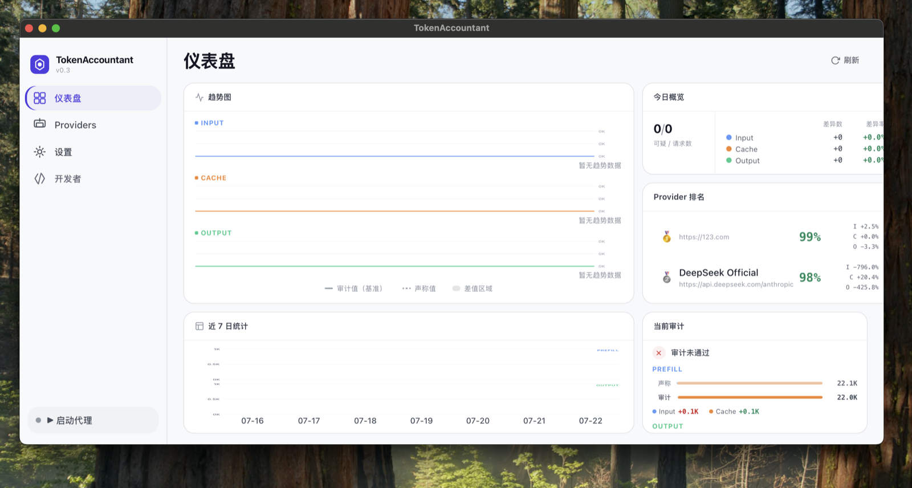

# TokenAccountant

TokenAccountant 是一个本地运行的 AI API Token 审计代理。它位于客户端与上游 Provider 之间，在不改变调用方式的前提下转发请求，并独立计算 Token、记录 Provider 声称的 usage，帮助发现计费差异与非标准响应。

> 当前版本重点校准 **DeepSeek V4 + vLLM** 场景，并支持 OpenAI、Anthropic 两种请求协议的流式转发与审计。



## 我们能检查什么

| 检查项 | TokenAccountant 如何检查 | 页面展示 |
| --- | --- | --- |
| Input Token | 使用本地 Tokenizer 和消息模板重新渲染、编码请求，与上游返回的 Input usage 独立对比 | 审计值、声称值、差异 |
| Cache Token | 模拟 vLLM 风格的前缀块复用，区分已缓存前缀与本次需要 Prefill 的 Token | Cache 声称值、检测值、差异 |
| Output Token | 从流式响应重建 assistant 输出并重新编码，与上游返回的 Output usage 对比 | Output 声称值、审计值、差异 |
| 三类 usage 拆分 | 对 OpenAI / Anthropic 响应中的 usage 字段做统一映射；DeepSeek 的 cache hit 不会重复计入 Input | Input、Cache、Output 分项统计 |
| 响应结构与 ID | 对 GPT / Claude 模型检查协议结构、事件类型以及常见响应 ID 前缀 | 一致、非标准、可疑 |
| HTTP 响应头 | 检查请求追踪头、厂商元信息头、协议交叉以及可能泄漏的 bridge / proxy / Cursor 头 | HTTP 指纹状态与问题详情 |
| Provider 表现 | 按 Provider 汇总请求、差异与通过率，观察近期稳定性 | 今日概览、趋势图、近 7 日统计、Provider 排名 |
| 渲染过程 | 保存本次检测文本和写入缓存时的完整文本，便于核对消息模板与前缀是否一致 | 开发者页面 |

### DeepSeek usage 映射

当前会把上游返回值归入三个互不抵扣的计费项：

| 请求协议 | Input | Cache | Output |
| --- | --- | --- | --- |
| OpenAI 兼容 | `prompt_cache_miss_tokens` | `prompt_cache_hit_tokens` | `completion_tokens` |
| Anthropic 兼容 | `input_tokens` | `cache_read_input_tokens` | `output_tokens` |

流式响应中的 usage 可能分布在多个 SSE 事件中，TokenAccountant 会在流结束后合并这些事件再生成审计记录。

## 判断边界

TokenAccountant 提供的是审计证据，不应仅凭一条记录直接认定 Provider 存在欺诈：

- 当前独立 Token 审计以 DeepSeek V4 为主要校准目标，内置官方 Tokenizer 资源和消息模板测试样例。
- 本地缓存检测模拟固定大小 Token 块的前缀复用；上游的 block size、cache salt、容量、淘汰策略、重启和生命周期不同，都可能形成差异。
- DeepSeek 托管服务的缓存是否命中由服务端决定。验证缓存问题时，应使用受控的重复请求确认前缀已经建立。
- 响应结构、ID 和 HTTP 头只能提供来源线索，不是上游身份的密码学证明；该检查目前仅对 OpenAI 与 Anthropic 模型族启用，DeepSeek 等其他模型不据此判定。
- 当前完整审计链路聚焦流式响应；非流式请求可以转发，但尚未生成同等完整的 Token 审计记录。

## 页面功能

- **仪表盘**：查看今日请求、Input / Cache / Output 趋势、近 7 日统计、Provider 排名和最近一次审计。
- **Providers**：添加、编辑、删除和切换上游 API 地址。
- **设置**：修改代理端口、自动启动选项、语言和开发者模式。
- **开发者**：检查 Tokenizer 实际检测文本与下一轮缓存文本；需先在设置中启用。
- **本地存储**：配置与 SQLite 审计数据保存在 `~/.tokenaccountant/`。

## 工作方式

```text
Claude Code / OpenAI-compatible Client
                 │
                 ▼
       TokenAccountant Proxy
         http://127.0.0.1:8080
                 │
       ┌─────────┴─────────┐
       │                   │
       ▼                   ▼
  转发至 Provider      本地独立审计
                           │
              Tokenizer + 消息模板
              前缀缓存 + usage 拆分
              响应结构 / HTTP 指纹
                           │
                           ▼
                     SQLite + Dashboard
```

## 开发环境启动

### 前置条件

- Node.js 18+
- Rust stable
- Tauri v2 对应的系统依赖

### 启动桌面应用

```bash
cd frontend
npm install
cd ..
cargo tauri dev
```

`cargo tauri dev` 会同时启动 Vite 开发服务器和 Tauri 桌面壳。只调试前端时也可以运行：

```bash
cd frontend
npm run dev
```

然后访问 `http://localhost:1420`。浏览器模式适合检查布局；代理、SQLite、设置保存等 Tauri 能力需要在桌面应用中验证。

### 构建与测试

```bash
# 前端类型检查与生产构建
cd frontend && npm run build

# Rust 单元测试
cd .. && cargo test

# 构建桌面安装包
cargo tauri build
```

## 技术栈

- React 18、TypeScript、Tailwind CSS、Vite
- Rust、Tauri v2、Axum、reqwest
- SQLite（rusqlite）
- Hugging Face tokenizers、tiktoken-rs

## 当前状态

项目仍处于开发阶段。Token 计算、消息模板和 usage 字段正在以真实上游响应与官方样例持续校准；用于费用争议前，请保留原始请求、响应和 Provider 账单交叉验证。
